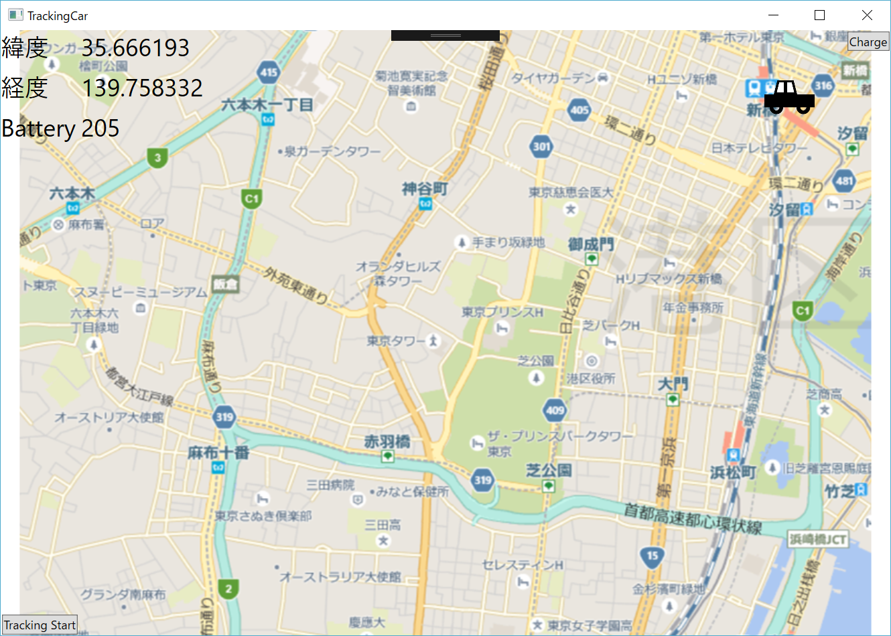

# C# WPF版サンプル 
MainWindow.xamlの 
```csharp
string azureIoTHubCS = "<< Azure IoT Hub Connection String for Device Id >>";
```
<<..>>をAzure IoT Hubに登録したDevice Idに対応する接続文字列に置き換えてください。 
アプリを起動し、 
  
のConnectボタンをクリックすると、Azure IoT Hubに接続し、service側のサンプルで設定したDesiredPropertiesを受信し表示します。 
更に、自動車の位置を移動可能なトラッキングウィンドウが表示されます。 
  
自動車の上でマウスをクリックし、そのまま移動させると、Azure IoT Hubに位置と速さ、方位が計測時間とともに送付されます。また、移動するごとにバッテリーレベルが低下していきます。 
地図上の自動車以外の場所でマウスをクリックすると、そこにゴールが設定され、その地点に向かって自動車が移動します。 
右上のchargeボタンをクリックすると、自動車は充電施設に向かって移動を開始します。充電施設に到達すると充電を開始します。この一連の動作中フェーズごとに、Statusが変わり、メインパネルの右下のReportをクリックすると、現状の位置も含め、Reported PropertiesとしてAzure IoT Hubに通知されます。 
移動中、バッテリーレベルが一定レベルを下回ると動けなくなります。 
